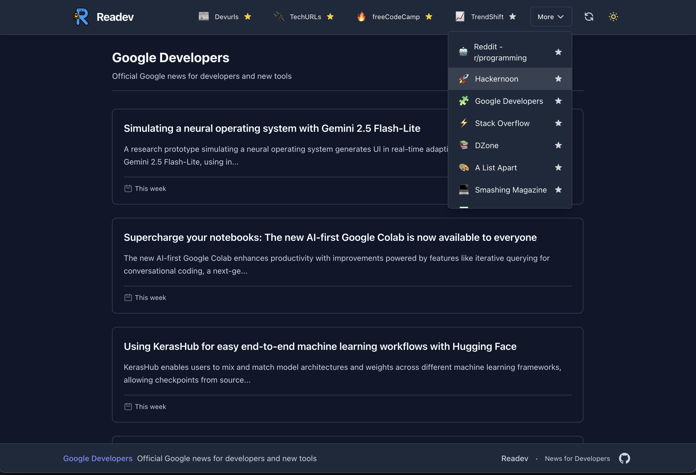

<div align="center">


# Readev

**A newspaper for developers — every time you open a new tab.**

[](https://opensource.org/licenses/MIT)


</div>

---

## 📰 About

**Readev** is a modern, open-source Chrome extension that transforms your new tab into a beautifully minimal developer news dashboard.

It aggregates content from top developer-centric sources and displays them in a focused, readable format — helping you stay updated with the latest in tech every time you open a new tab.

<div align="center">

<p><em>Readev in action: Your new tab transformed into a developer news dashboard</em></p>
</div>

---

## 🌐 What It Does

✅ Replaces your Chrome new tab with a customizable news panel
📰 Shows content from trusted sources like:

- [Dev.to](https://dev.to) 👩‍💻
- [freeCodeCamp](https://www.freecodecamp.org/news/) 🔥
- [Google Developers](https://developers.googleblog.com/) 🧩
- [Lobste.rs](https://lobste.rs) 🦞
- [HackerNoon](https://hackernoon.com) 🚀
- [Reddit r/programming](https://www.reddit.com/r/programming/) 🤖
- [Stack Overflow Blog](https://stackoverflow.blog/) ⚡
- [TrendShift](https://trendshift.io) 📈
- [TuxURLs](https://tuxurls.com) 🐧
- [DZone](https://dzone.com) 📚
- and more...

🎨 Clean, responsive interface with dark/light mode support
🔒 No tracking, ads, or logins — just dev content via secure iframes
💾 Remembers your last viewed source

---

## 🎯 Why Readev?

> Open a new tab. See what’s happening in tech. Every time.
> No distractions. No noise. Just the dev news that matters.

Readev is your silent companion for staying informed, learning, and exploring new tools — without leaving the browser.

---

## 🤝 How to Contribute

Want to add your favorite developer news source to Readev? Contributions are welcome and encouraged!

### 🔗 Add a New Source

1. Open a pull request (PR) editing the following file:
   👉 [`sources.json`](https://github.com/AliYmn/readev/blob/main/src/sources.json)

2. Add your new source using the following structure:

```json
{
  "name": "Example Source",
  "url": "https://example.com",
  "description": "Short description of what this site offers",
  "type": "site",
  "emoji": "🧠"
}
```

- Use `"type": "site"` for iframe-compatible sites.
- Use `"type": "feed"` and `feed_url` if the site does **not** allow iframe embedding but provides an RSS or Atom feed.

### ⚠️ Iframe Compatibility

- Make sure the site allows embedding in an iframe (no restrictive `X-Frame-Options` or `Content-Security-Policy` headers).
- If the site **does not support iframe**, you can still include it using a valid RSS/Atom feed.

### 🚀 Tips

- Choose trusted, high-quality developer content sources.
- Add a clear, concise description.
- Use a relevant emoji to improve visual clarity.

Once your PR is reviewed and merged, the source will appear in the next release of Readev.

---

## 🔧 Installation

### Local Installation (Developer Mode)

1. Download the latest release ZIP file (`readev.zip`) from the [releases page](https://github.com/AliYmn/readev/releases) or clone this repository and build it yourself.

2. Open Chrome and navigate to `chrome://extensions/`

3. Enable "Developer mode" by toggling the switch in the top-right corner.

4. Click on "Load unpacked" button.

5. Select the extracted ZIP folder or the `dist` directory if you built it yourself.

6. The Readev extension should now be installed and will replace your new tab page.

### Chrome Web Store Installation

1. Visit the [Readev Chrome Extension page](https://chrome.google.com/webstore/detail/readev/[extension-id]) on the Chrome Web Store.

2. Click the "Add to Chrome" button.

3. Confirm by clicking "Add extension" in the popup.

4. Once installed, open a new tab to start using Readev!

### Updating the Extension

- **Chrome Web Store version**: Updates will be automatically applied when published.
- **Local installation**: Download the latest release and follow the installation steps again, or pull the latest changes and rebuild if you're using the source code.

---

## 🧡 Open Source

This project is open-source and MIT licensed.
Built by developers, for developers who value simplicity, open knowledge, and beautiful tools.

---

> **Readev** – built for the curious developer.
